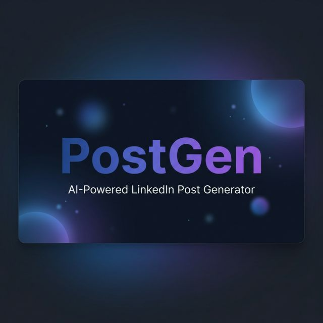

<div align="center">
  

  <h1>PostGen</h1>
  <p><strong>AI-Powered LinkedIn Post Generator — Free, Open Source, Built for Scale</strong></p>

  <p>
    Generate engaging, personalized LinkedIn posts in seconds using Google Gemini.
    <br />
    A cost-optimized 3-stage AI pipeline that uses just <strong>2 LLM calls</strong> — regardless of how many posts you generate.
  </p>

  <br />

  <p>
    <a href="#-quick-start"><strong>Quick Start</strong></a> ·
    <a href="#-architecture"><strong>Architecture</strong></a> ·
    <a href="#-features"><strong>Features</strong></a> ·
    <a href="#-contributing"><strong>Contributing</strong></a>
  </p>

  <br />

[](https://nextjs.org)
[](https://typescriptlang.org)
[](https://ai.google.dev)
[](https://tailwindcss.com)
[](LICENSE)

</div>

---

## ✨ Why PostGen?

Most AI writing tools charge per generation, use server-side API keys ($$), or produce generic, cookie-cutter content. PostGen takes a different approach:

| Problem                               | PostGen's Solution                                            |
| ------------------------------------- | ------------------------------------------------------------- |
| AI tools are expensive                | **Free forever** — bring your own Gemini API key              |
| N posts = N API calls = slow & costly | **Constant 2 LLM calls** regardless of post count             |
| AI hallucinates facts                 | **Web scraping pipeline** grounds content in real data        |
| Generated posts all sound the same    | **Explicit diversity prompts** enforce unique styles per post |
| API keys stored on random servers     | **Session-only storage** — key never leaves your browser      |

---

## 🚀 Quick Start

### Prerequisites

- **Node.js** 18+
- **npm** or **yarn**
- A free [Google Gemini API key](https://aistudio.google.com/apikey)

### Installation

```bash
# Clone the repository
git clone https://github.com/ashusnapx/linkedin-post-generator.git
cd linkedin-post-generator

# Install dependencies
npm install

# Set up environment variables
cp .env.example .env
# Add your Gemini API key to .env (or use the in-app modal)

# Start development server
npm run dev
```

Open [http://localhost:3000](http://localhost:3000) and start generating posts.

### Environment Variables

| Variable                         | Required | Description                                               |
| -------------------------------- | -------- | --------------------------------------------------------- |
| `NEXT_PUBLIC_GEMINI_API_KEY`     | Optional | Default Gemini API key (users can bring their own via UI) |
| `KV_REST_API_URL`                | Optional | Upstash/Vercel KV URL for rate limiting                   |
| `KV_REST_API_TOKEN`              | Optional | Upstash/Vercel KV token                                   |
| `NEXT_PUBLIC_COST_PER_1K_TOKENS` | Optional | Override cost per 1K tokens (default: `0.03`)             |

> **Note:** The app works without any environment variables. Users connect their own API key through the onboarding modal.

---

## 🏗 Architecture

### High-Level Overview

```
┌─────────────────────────────────────────────────────────────────┐
│                        BROWSER (Client)                         │
│                                                                 │
│  ┌──────────┐   ┌──────────────┐   ┌────────────────────────┐  │
│  │  Hero    │──▶│  Generator   │──▶│  POST /api/generate    │  │
│  │  Section │   │  Form + UI   │   │  (with X-API-Key hdr)  │  │
│  └──────────┘   └──────────────┘   └──────────┬─────────────┘  │
│                                                │                │
└────────────────────────────────────────────────┼────────────────┘
                                                 │
┌────────────────────────────────────────────────▼────────────────┐
│                     NEXT.JS API ROUTE (Server)                  │
│                                                                 │
│  Rate Limit ──▶ Validate Body ──▶ Init Gemini ──▶ Run Pipeline  │
│                                                                 │
│  ┌─────────────────── 3-STAGE PIPELINE ──────────────────────┐  │
│  │                                                           │  │
│  │  ┌──────────────┐   ┌──────────────┐   ┌──────────────┐  │  │
│  │  │  Stage 1     │   │  Stage 2     │   │  Stage 3     │  │  │
│  │  │  Fact Fetch  │──▶│  Plan Gen    │──▶│  Batch Draft │  │  │
│  │  │  (No LLM)   │   │  (1 LLM Call)│   │  (1 LLM Call)│  │  │
│  │  └──────┬───────┘   └──────────────┘   └──────────────┘  │  │
│  │         │                                                 │  │
│  │    DuckDuckGo                    Google Gemini 2.5 Flash  │  │
│  │    + Cheerio                                              │  │
│  └───────────────────────────────────────────────────────────┘  │
│                                                                 │
│  ┌───────────────── POST-PROCESSING ─────────────────────────┐  │
│  │  Guardrails: Profanity Check │ Risky Claims │ Hashtag QA  │  │
│  └───────────────────────────────────────────────────────────┘  │
│                                                                 │
└─────────────────────────────────────────────────────────────────┘
```

### The 3-Stage Pipeline

The pipeline is the core innovation. It's designed to **minimize LLM calls** and **maximize content quality**:

#### Stage 1: Fact Retrieval `(No LLM — 0 tokens)`

- Searches DuckDuckGo for the user's topic
- Scrapes top results with Cheerio
- Scores pages by relevance (title match, keyword density, content length)
- Returns grounded factual context to prevent hallucination

#### Stage 2: Plan Generation `(1 LLM Call)`

- Sends topic + facts + user preferences to Gemini
- Generates structured plans: `{ hook, points, cta, example_angle }`
- Each plan represents a unique angle on the topic

#### Stage 3: Batch Drafting + Enrichment `(1 LLM Call)`

- **All plans are drafted in a single LLM call** — this is the key optimization
- Includes hashtag generation, CTA insertion, and safety flags
- Explicit diversity prompts prevent repetitive output

### Cost Comparison

| Approach                                | LLM Calls for 5 Posts | Estimated Tokens |
| --------------------------------------- | --------------------- | ---------------- |
| Naive (plan + N drafts + N enrichments) | **11 calls**          | ~15,000          |
| Semi-optimized (plan + N drafts)        | **6 calls**           | ~10,000          |
| **PostGen (plan + 1 batch call)**       | **2 calls**           | **~4,000**       |

> **Result: ~60-70% token savings** compared to naive implementations.

---

## 📋 Features

### Content Generation

- 🎯 **Topic-based generation** — enter any subject, get polished posts
- 🎨 **4 writing tones** — Startup Founder, Career Coach, Techie, Analyst
- 📏 **3 length options** — Short, Medium, Long
- 🌍 **3 languages** — English, Hindi, Hinglish
- 🔢 **Batch generation** — 3, 4, or 5 posts per run

### Customization

- 🌡️ **Temperature control** — slide from conservative (0) to creative (1)
- #️⃣ **Hashtag control** — toggle + set limit (0-10)
- 📢 **CTA styles** — Question, Directive, Soft Ask, or No CTA
- 📖 **Reading levels** — Grade 6 through Professional
- 🎲 **Seed support** — reproducible generations

### Quality & Safety

- 🔍 **Fact grounding** — web scraping prevents LLM hallucination
- 🛡️ **Content guardrails** — profanity detection + risky claim flagging
- ✅ **Hashtag validation** — format, length, and count checks

### User Experience

- 🌙 **Dark/Light mode** — system preference detection + manual toggle
- ♿ **Accessible** — ARIA live regions, skip links, reduced motion support
- 📱 **Responsive** — mobile-first design with adaptive layout
- 🔑 **BYOK model** — bring your own API key, free forever
- 📋 **One-click copy** — copy any generated post instantly

### Infrastructure

- ⚡ **Rate limiting** — Upstash Redis sliding window (10 req/min/IP)
- 📊 **Cost tracking** — real-time token count, latency, and USD estimates
- ❤️ **Health monitoring** — footer health indicator for service status
- 🔒 **Secure** — API keys in sessionStorage only, never logged or persisted

---

## 🧱 Project Structure

```
linkedin-post-generator/
├── app/                           # Next.js 15 App Router
│   ├── layout.tsx                 # Root layout (providers, fonts, metadata)
│   ├── page.tsx                   # Home page (Hero + Generator)
│   └── api/
│       ├── generate-posts/        # POST — Main generation endpoint
│       ├── health/                # GET  — Health check
│       └── validate-key/         # POST — API key validation
│
├── src/                           # Core business logic (zero UI deps)
│   ├── config/                    # Centralized configuration
│   ├── services/                  # Pipeline services
│   │   ├── handlerService.ts      # Top-level orchestrator
│   │   ├── factService.ts         # Web scraping (DuckDuckGo + Cheerio)
│   │   ├── plannerService.ts      # LLM call #1 — plan generation
│   │   ├── batchDraftingService.ts # LLM call #2 — batch drafting
│   │   └── pipeline/              # Pipeline runner + stages
│   │       ├── intentNormalization.ts  # Topic cleanup (no LLM)
│   │       └── guardrails.ts      # Safety checks (no LLM)
│   ├── context/                   # React Context (API key state)
│   ├── hooks/                     # Custom hooks (form handler)
│   ├── lib/                       # Infrastructure (Gemini client, rate limiter, logger)
│   └── utils/                     # Helpers (JSON parser, cost calc, validation)
│
├── components/                    # React UI components
│   ├── Hero.tsx                   # Landing section
│   ├── Generator.tsx              # 2-column form + output layout
│   ├── Navbar.tsx                 # Navigation with API key status
│   ├── Footer.tsx                 # Footer with health indicator
│   ├── ApiKeyModal.tsx            # API key onboarding dialog
│   ├── AdvancedSettings.tsx       # Temperature, seed, CTA config
│   ├── forms/                     # Declarative form field system
│   ├── posts/                     # Post cards, detail dialog
│   ├── layout/                    # Output wrapper, status header
│   └── ui/                        # shadcn/ui primitives
│
└── lib/                           # Form schema + constants
    ├── schema.ts                  # Zod validation schema
    └── constants.ts               # Form option enums
```

---

## 🛠 Tech Stack

<table>
  <tr>
    <td align="center" width="96">
      
      <br>Next.js 15
    </td>
    <td align="center" width="96">
      
      <br>TypeScript
    </td>
    <td align="center" width="96">
      
      <br>Tailwind v4
    </td>
    <td align="center" width="96">
      
      <br>React 19
    </td>
    <td align="center" width="96">
      
      <br>Vercel
    </td>
  </tr>
</table>

| Category          | Technology                   | Purpose                                        |
| ----------------- | ---------------------------- | ---------------------------------------------- |
| **Framework**     | Next.js 15 + Turbopack       | SSR, API routes, fast dev builds               |
| **AI/LLM**        | Google Gemini 2.5 Flash Lite | Content generation (fast, cheap, high quality) |
| **UI**            | Radix UI + shadcn/ui         | Accessible, headless component primitives      |
| **Styling**       | Tailwind CSS v4              | Utility-first CSS framework                    |
| **Forms**         | React Hook Form + Zod        | Type-safe validation with no re-renders        |
| **Animations**    | Framer Motion                | Spring physics + reduced-motion support        |
| **Scraping**      | Cheerio + node-fetch         | Server-side HTML parsing for fact retrieval    |
| **Rate Limiting** | Upstash Redis (Vercel KV)    | Serverless-compatible sliding window           |
| **Theming**       | next-themes                  | Dark/light mode with system detection          |
| **Rendering**     | react-markdown               | Render AI-generated markdown content           |

---

## 🔒 Security

PostGen follows a **Bring Your Own Key (BYOK)** model:

- 🔐 **Session-only storage** — API keys stored in `sessionStorage`, cleared when tab closes
- 🚫 **Never persisted** — keys are never saved to databases or logs
- 🛡️ **Header transport** — keys sent via `X-API-Key` header, not URL params
- 🔑 **User control** — connect and disconnect your key at any time
- 🏗️ **Zero server-side keys** — no backend billing, no key rotation needed

---

## 📡 API Reference

### `POST /api/generate-posts`

Generate LinkedIn posts based on topic and preferences.

**Headers:**

```
X-API-Key: your-gemini-api-key
Content-Type: application/json
```

**Request Body:**

```json
{
  "topic": "Cold-start strategies for marketplaces",
  "tone": "Startup Founder",
  "audience": "Founders, PMs",
  "length": "medium",
  "postCount": 3,
  "addHashtags": true,
  "addCTA": true,
  "language": "English",
  "allowEmojis": true,
  "temperature": 0.7,
  "hashtagLimit": 5,
  "ctaStyle": "Question",
  "readingLevel": "Professional"
}
```

**Response:**

```json
{
  "posts": [
    {
      "content": "Every marketplace faces the chicken-and-egg problem...",
      "hashtags": ["marketplace", "startup", "growth"],
      "cta": "What was your biggest cold-start challenge?",
      "flags": { "profanity": false, "riskyClaims": [] }
    }
  ],
  "meta": {
    "tokens": 3847,
    "latencyMs": 2340,
    "costUSD": 0.0077,
    "model": "gemini-2.5-flash-lite"
  }
}
```

### `GET /api/health`

Returns service health status and dependency checks.

### `POST /api/validate-key`

Validates a Gemini API key by making a minimal 1-token request.

---

## 🧩 Design Decisions

| Decision               | Choice                 | Reasoning                                                 |
| ---------------------- | ---------------------- | --------------------------------------------------------- |
| **LLM Provider**       | Gemini Flash           | Cheapest per-token, fast inference, good quality          |
| **Fact Source**        | DuckDuckGo scraping    | No API key needed, no rate limits, free                   |
| **Drafting Strategy**  | Single batch call      | 2 LLM calls vs. 2N+1 — major cost savings                 |
| **Key Storage**        | `sessionStorage`       | More secure than `localStorage`, cleared on tab close     |
| **Rate Limit Failure** | Fail-open              | Availability over restriction (users have their own keys) |
| **Config Management**  | Centralized `config/`  | Single source of truth, feature-flag ready                |
| **Form Validation**    | Dual (client + server) | Never trust the client — Zod on both sides                |
| **Pipeline Stages**    | Self-documenting       | Each stage declares if it uses LLM and why                |

---

## 🤝 Contributing

Contributions are welcome! Here's how to get started:

1. **Fork the repository**
2. **Create a feature branch** — `git checkout -b feature/amazing-feature`
3. **Commit your changes** — `git commit -m 'Add amazing feature'`
4. **Push to the branch** — `git push origin feature/amazing-feature`
5. **Open a Pull Request**

### Development

```bash
# Install dependencies
npm install

# Start dev server with Turbopack
npm run dev

# Build for production
npm run build

# Run linter
npm run lint
```

---

## 📄 License

This project is licensed under the MIT License — see the [LICENSE](LICENSE) file for details.

---

## 🙏 Acknowledgments

- [Google Generative AI](https://ai.google.dev) for Gemini API
- [shadcn/ui](https://ui.shadcn.com) for beautiful, accessible components
- [Vercel](https://vercel.com) for Next.js and deployment infrastructure
- [Upstash](https://upstash.com) for serverless Redis

---

<div align="center">
  <p>
    <strong>Built with ❤️ by <a href="https://github.com/ashusnapx">ashusnapx</a></strong>
  </p>
  <p>
    If PostGen helped you, consider giving it a ⭐
  </p>
</div>
